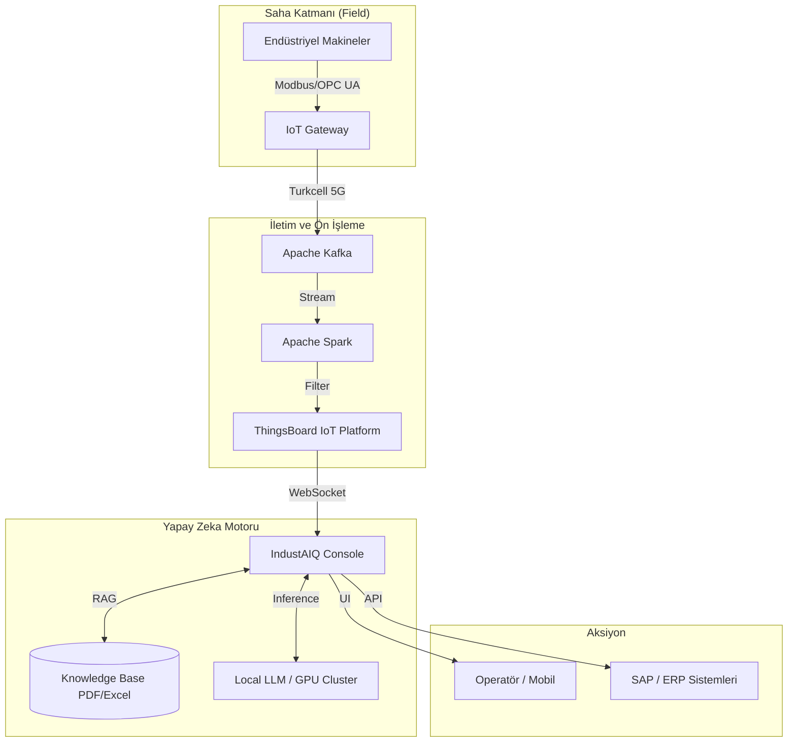

# ⚡ IndustAIQ Console

**5G Destekli Akıllı Endüstriyel Teşhis ve Kestirimci Bakım Platformu**

IndustAIQ Console, endüstriyel makinelerden (Siemens, ABB vb.) gelen verileri **Modbus** ve **OPC UA** protokolleri ile toplayıp, **Turkcell 5G** altyapısı üzerinden düşük gecikmeyle analiz eden yeni nesil bir bakım yönetim sistemidir.

Proje, **Apache Kafka** ve **Spark** ile akan veriyi (Big Data Streaming) işlerken, sanayiye özel eğitilmiş **Üretken Yapay Zeka (GenAI)** modelleri ve yerel LLM (Ollama) kullanarak arıza tespitinde %90'ın üzerinde doğruluk sağlar. Kullanıcılarına bir sosyal medya uygulaması kolaylığı sunan platform, karmaşık endüstriyel verileri günlük konuşma diliyle sorgulanabilir hale getirir.

---

## 🎯 Temel Yetenekler ve Değer Önerisi

### 🏭 Endüstriyel Derin Teknoloji
- **Kestirimci Bakım (Predictive Maintenance):** Geçmiş arıza paternleriyle eğitilen algoritmalar sayesinde anomali tespiti yapılır ve yanlış alarmlar minimize edilir.
- **Protokol Bağımsızlık:** Siemens, ABB gibi farklı markalardan Modbus ve OPC UA standartlarıyla veri toplama.
- **Yüksek Hız ve Güvenlik:** Veriler Turkcell 5G ağıyla milisaniyelik gecikmelerle taşınır, mikroservis mimarisiyle izole edilmiş Turkcell Bulut sunucularında işlenir.

### 🧠 AI Destekli Analiz & Asistan
- **Akıllı Doküman Asistanı:** Yöneticiler ve operatörler, PDF/Excel formatındaki teknik dokümanlarla (RAG) beslenen sisteme mobilden sesli/yazılı soru sorabilir.
- **Anlık Reçete:** Oluşan bir alarm durumunda, yerel LLM (Llama 3.1) alarm kodunu analiz eder ve operatöre saniyeler içinde çözüm önerisi sunar.
- **Otomatik Aksiyon:** Tespit edilen kritik arızalar için SAP/ERP sistemlerine otomatik bakım emri gönderilebilir.

### 📊 Gerçek Zamanlı İzleme ve Raporlama
- **Canlı Telemetri:** ThingsBoard WebSocket entegrasyonu ile sensör verilerinin anlık takibi.
- **Çok Dilli Destek:** 10 dilde arayüz ve çeviri desteği.
- **Görsel Raporlama:** Karmaşık verilerin sadeleştirilmiş grafiklerle sunumu.

---

## 🏗️ Sistem Mimarisi

IndustAIQ, sahadan buluta uzanan uçtan uca (Edge-to-Cloud) bir mimari kullanır:



### Teknoloji Yığını (Tech Stack)

* **IoT & İletişim:** ThingsBoard, Modbus, OPC UA, WebSocket, 5G
* **Big Data:** Apache Kafka, Apache Spark
* **AI/ML:** Ollama (Llama 3.1), Scikit-learn, Özel GenAI Modelleri
* **Altyapı:** Turkcell Bulut, GPU Kümeleri, Docker
* **Backend/Frontend:** Python 3.8+, Streamlit
* **Veritabanı:** SQLite, PostgreSQL

---

## 🚀 Kurulum ve Hızlı Başlangıç

Sistemin geliştirici ortamında (Local Dev) ayağa kaldırılması için:

### Gereksinimler

* Python 3.8+
* Ollama (Yerel LLM servisi)
* ThingsBoard (IoT platform erişimi)

### Adım Adım Kurulum

```bash
# 1. Depoyu klonla
git clone https://github.com/yourusername/industaiq-console.git
cd industaiq-console

# 2. Sanal ortam oluştur
python -m venv venv
source venv/bin/activate  # Windows: venv\Scripts\activate

# 3. Bağımlılıkları yükle
pip install -r requirements.txt

# 4. Ollama modelini indir (Llama 3.1)
ollama pull llama3.1

# 5. Konfigürasyon
cp .env.example .env
# .env dosyasını ThingsBoard ve LLM ayarlarınızla düzenleyin

# 6. Teknik Dokümanları Yükle (RAG için)
mkdir -p sources
cp /path/to/manuals/*.pdf sources/

# 7. Uygulamayı başlat
streamlit run main.py

```

---

## ✅ Saha Doğrulaması ve Referanslar

Bu proje, laboratuvar ortamından çıkarılarak **Gürçelik** ve **SAES** gibi firmaların gerçek fabrika sahalarında test edilmiştir.

* **Test Kapsamı:** 5G veri iletimindeki yük (stres) testleri.
* **Güvenlik:** Kapalı devre güvenlik doğrulama adımları.
* **Performans:** AI modellerinin görselleştirme ve doğruluk oranları sahada doğrulanmıştır.

---

## 🔮 Gelecek Vizyonu

IndustAIQ, **Otonom Fabrika** konseptine liderlik etmeyi hedefler:

* **Otonom Karar Verme:** İnsan müdahalesine gerek kalmadan bakım planlaması.
* **Dijital İkiz (Digital Twin):** Fabrika süreçlerinin sanal simülasyonu.
* **Trend Analizi:** Tarihsel büyük veriden stratejik üretim öngörüleri.

---

## 📝 Lisans

Bu proje [GNU General Public License v2.0](LICENSE) altında lisanslanmıştır.

**Versiyon**: 2.0
